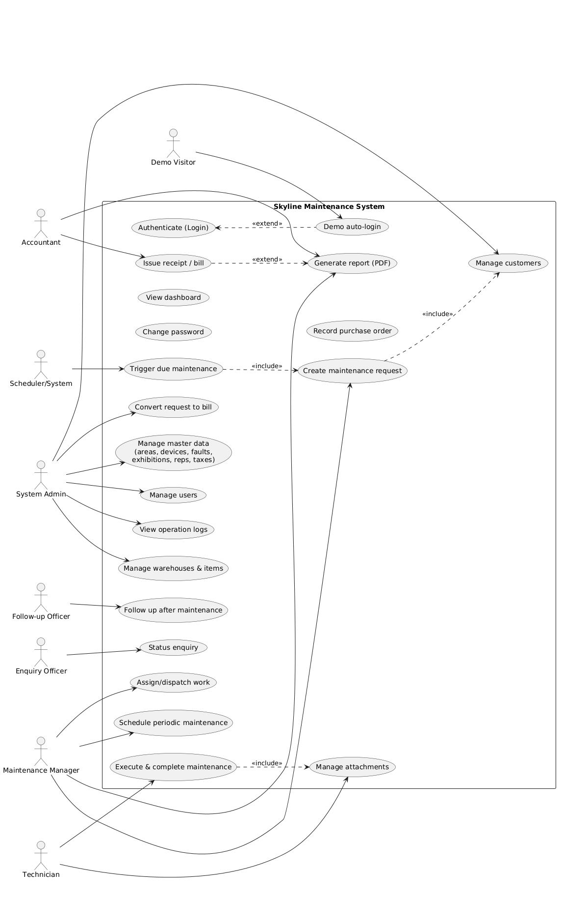
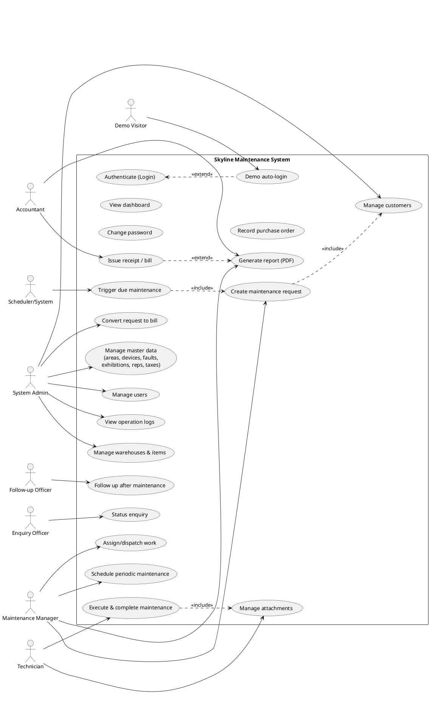

# Skyline Maintenance System — Use Cases

> Integrated Maintenance Management System (نظام إدارة الصيانة المتكامل)
> Angular SPA (hash-routed, JWT in localStorage) + ASP.NET (.NET 8) API + SQL Server.

This document captures the system's actors and use cases. It is derived from the
implemented roles (`Tbl_User_level`), Angular routes/guards, and the API service layer.

---

## 1. Actors

| Actor | Role (`User_level`) | Description |
|---|---|---|
| **System Administrator** (مدير النظام) | 9 | Full access. Manages master data, users, inventory, billing config, and views logs. |
| **Maintenance Manager** (مدير الصيانة) | 1 | Creates/edits maintenance requests, assigns work, oversees the maintenance lifecycle. |
| **Maintenance Technician** (فني) | 3 | Executes assigned maintenance jobs and records results/parts used. |
| **Accountant** (محاسب) | 6 | Issues receipts/bills (سندات القبض) and handles financial documents. |
| **Follow-up Officer** (مسؤول المتابعة) | 7 | Performs after-maintenance follow-up and customer satisfaction tracking. |
| **Enquiry Officer** (الاستعلام) | 8 | Read-oriented lookups and status enquiries. |
| **Public Demo Visitor** | 1 (demo acct) | Auto-signed-in, sandboxed preview embedded in the marketing site (`?demo=1`). |
| **Scheduler / System** (time-based) | — | Non-human actor that triggers periodic/scheduled maintenance due-dates. |

**Generalization:** the System Administrator can perform every use case available to the
functional roles; each functional role is a specialization with a restricted subset.

---

## 2. Use Case Diagram (PlantUML)

> Rendered diagram: `use-cases-diagram.png` (also available as `use-cases-diagram.svg`).
> Regenerate from the PlantUML source below after edits.

---

## 3. Use Case Catalog (by subsystem)

### 3.1 Access & Account
| ID | Use Case | Primary Actor |
|---|---|---|
| UC-01 | Authenticate (Login) | All staff roles |
| UC-02 | Demo auto-login (public preview) | Demo Visitor |
| UC-03 | Change password | All staff roles |
| UC-04 | Role-based navigation / access control | System |
| UC-05 | View dashboard | All staff roles |

### 3.2 Master Data (Definitions — admin)
| ID | Use Case | Primary Actor |
|---|---|---|
| UC-10 | Manage customers (العملاء) | Admin |
| UC-11 | Manage exhibitions/showrooms (المعارض) | Admin |
| UC-12 | Manage areas (المناطق) | Admin |
| UC-13 | Manage representatives (المندوبين) | Admin |
| UC-14 | Manage technicians (تعريف الفنيين) | Admin |
| UC-15 | Define devices (تعريف الأجهزة) | Admin |
| UC-16 | Define faults (تعريف الأعطال) | Admin |
| UC-17 | Define taxes (تعريف الضرائب) | Admin |
| UC-18 | Manage users (المستخدمين) | Admin |
| UC-19 | View operation logs (سجل العمليات) | Admin |

### 3.3 Maintenance Lifecycle
| ID | Use Case | Primary Actor |
|---|---|---|
| UC-20 | Create maintenance request (طلب صيانة) | Manager |
| UC-21 | Edit / view maintenance request | Manager |
| UC-22 | Assign / dispatch work to technician | Manager |
| UC-23 | Execute & complete maintenance | Technician |
| UC-24 | Upload / view attachments (images, docs) | Technician / Manager |
| UC-25 | After-maintenance follow-up (متابعة) | Follow-up Officer |
| UC-26 | Status enquiry (استعلام) | Enquiry Officer |
| UC-27 | Schedule periodic maintenance (الصيانة الدورية) | Manager |
| UC-28 | Trigger due scheduled maintenance | Scheduler/System |

### 3.4 Inventory & Procurement
| ID | Use Case | Primary Actor |
|---|---|---|
| UC-30 | Manage warehouses (المستودعات) | Admin |
| UC-31 | Manage items / materials (المواد) | Admin |
| UC-32 | Record purchase order (warehouse purchase) | Admin |
| UC-33 | Convert warehouse transactions | Admin |

### 3.5 Billing & Reporting
| ID | Use Case | Primary Actor |
|---|---|---|
| UC-40 | Issue receipt / bill (سندات القبض) | Accountant |
| UC-41 | View bill for a maintenance job | Accountant / Admin |
| UC-42 | Convert maintenance request to bill | Admin |
| UC-43 | Generate report / export PDF | Manager / Accountant |

---

## 4. Detailed Use Case Specifications

### UC-01 — Authenticate (Login)
- **Actor:** Any staff role.
- **Goal:** Obtain an authenticated session to use the system.
- **Preconditions:** User has an active account (`Tbl_Users`, not soft-deleted).
- **Main flow:**
  1. User opens the app; the login screen is shown.
  2. User enters username (`UserNmAr`) and password.
  3. System calls `POST /api/TblUsers/Login`; the API verifies the HMAC-SHA512 password hash.
  4. API returns a signed JWT (claims: `nameid`, `unique_name`, `role_id`, role name, email).
  5. SPA stores the token in `localStorage` and routes to the dashboard (or role landing page).
- **Alternate / Exception:**
  - 3a. Invalid credentials → API returns `Unauthorized`; SPA shows an error toast, stays on login.
  - 4a. Token expired on later requests → guards redirect back to login.
- **Postcondition:** Valid JWT present; role-based menu rendered.

### UC-02 — Demo auto-login (public preview)
- **Actor:** Public Demo Visitor (via marketing-site iframe).
- **Goal:** Let a visitor preview the system without credentials.
- **Preconditions:** App opened with `?demo=1` before the hash; backend demo endpoint enabled
  with a configured demo user.
- **Main flow:**
  1. App boots; an `APP_INITIALIZER` reads `window.location.search` and detects `demo=1`.
  2. With no valid session, SPA calls `POST /api/TblUsers/DemoLogin` (no credentials sent).
  3. API mints a **short-lived** demo JWT for the dedicated demo account and returns `{ token }`.
  4. SPA stores the token and lands on the dashboard; a "Demo — sample data" badge is shown.
- **Alternate / Exception:**
  - 2a. Endpoint unavailable / not configured → fail open to the normal login screen.
- **Postcondition:** Read-oriented demo session active; normal login path unaffected when `demo=1` absent.

### UC-20 — Create maintenance request
- **Actor:** Maintenance Manager (also Admin).
- **Goal:** Register a new maintenance job for a customer/device.
- **Preconditions:** Authenticated as role 1 or 9; relevant customer/device master data exists.
- **Main flow:**
  1. Manager opens **Maintenance Requests → Add**.
  2. Selects the customer (and exhibition/area), device, and reported fault.
  3. Enters description, priority, and contact/scheduling details.
  4. Optionally attaches images/documents.
  5. System persists the request and assigns it an identifier and an initial status.
- **Alternate / Exception:**
  - 2a. Customer not found → Manager triggers *Manage customers* (UC-10) to add one, then returns.
  - 5a. Validation error (missing required field) → inline error; record not saved.
- **Postcondition:** New maintenance request stored and visible in the requests list.

### UC-22 — Assign / dispatch work to technician
- **Actor:** Maintenance Manager.
- **Goal:** Route an open request to the right technician.
- **Preconditions:** An open maintenance request exists; technicians are defined.
- **Main flow:**
  1. Manager opens the request and selects a technician (and schedule slot).
  2. System records the assignment and updates the request status to *assigned/in-progress*.
- **Alternate:** 1a. Reassign to a different technician → previous assignment superseded.
- **Postcondition:** Request appears in the assigned technician's queue.

### UC-23 — Execute & complete maintenance
- **Actor:** Maintenance Technician (role 3).
- **Goal:** Carry out the job and record the outcome.
- **Preconditions:** A request is assigned to the technician.
- **Main flow:**
  1. Technician opens **Technician Maintenance** and selects an assigned job.
  2. Records work performed, fault diagnosis, and parts/items consumed (from inventory).
  3. Attaches before/after photos (UC-24).
  4. Marks the job complete (or pending parts / re-visit).
- **Alternate / Exception:**
  - 2a. Required part out of stock → flag for procurement (UC-32); job set to *pending parts*.
  - 4a. Customer not available → job set to *follow-up required* (feeds UC-25).
- **Postcondition:** Job status updated; consumption recorded; ready for follow-up/billing.

### UC-25 — After-maintenance follow-up
- **Actor:** Follow-up Officer (role 7).
- **Goal:** Confirm completion quality and customer satisfaction.
- **Preconditions:** Job marked complete or flagged for follow-up.
- **Main flow:**
  1. Officer opens **After-maintenance / Follow**.
  2. Contacts customer, records outcome (satisfied / re-open / escalate).
  3. Updates the record; re-opens a request if needed (loops to UC-20/UC-22).
- **Postcondition:** Follow-up outcome logged; lifecycle closed or re-opened.

### UC-27 — Schedule periodic maintenance
- **Actor:** Maintenance Manager.
- **Goal:** Define recurring maintenance for a customer/device.
- **Preconditions:** Customer/device exist.
- **Main flow:**
  1. Manager opens **Scheduled Maintenance → Add**.
  2. Selects customer/device, interval, and start date.
  3. System stores the schedule with its next due date.
- **Postcondition:** Schedule persisted; eligible for UC-28.

### UC-28 — Trigger due scheduled maintenance
- **Actor:** Scheduler / System (time-based).
- **Goal:** Surface schedules whose due date has arrived as actionable requests.
- **Main flow:**
  1. On/after the due date, the schedule becomes due.
  2. The Manager is presented the due item and generates a maintenance request (includes UC-20).
- **Postcondition:** Periodic job enters the normal maintenance lifecycle.

### UC-40 — Issue receipt / bill
- **Actor:** Accountant (role 6; also Admin role 9).
- **Goal:** Produce a financial receipt for completed work/services.
- **Preconditions:** Authenticated as role 6 or 9; relevant job/customer exists; taxes defined (UC-17).
- **Main flow:**
  1. Accountant opens **Bills / Receipts (سندات القبض)**.
  2. Selects customer/job, adds line items and amounts; taxes applied per configuration.
  3. System computes totals and persists the bill.
  4. Optionally generates a printable PDF (UC-43).
- **Alternate:** 2a. Convert an existing maintenance job to a bill (UC-42) to pre-fill line items.
- **Postcondition:** Bill recorded; PDF available for print/share.

### UC-43 — Generate report / export PDF
- **Actor:** Manager / Accountant / Admin.
- **Goal:** Produce a printable document (bill, contract, maintenance report).
- **Preconditions:** Source record exists.
- **Main flow:**
  1. User selects a record and chooses *Print/Export*.
  2. API renders a PDF (server-side, wkhtmltopdf/DinkToPdf) with Arabic-capable fonts.
  3. The document is returned for download/print.
- **Postcondition:** PDF delivered to the user.

### UC-18 — Manage users
- **Actor:** System Administrator (role 9).
- **Goal:** Create, edit, view, or deactivate system users and their roles.
- **Preconditions:** Authenticated as role 9.
- **Main flow:**
  1. Admin opens **Add/Manage User**.
  2. Enters name, email, role (`User_level`), and initial password (hashed server-side).
  3. System creates the user (`AddNewUser`) and returns the new id.
- **Alternate / Exception:**
  - Edit existing user (`EditeUsers`); soft-delete (`softDeleteUsers`) to deactivate.
- **Postcondition:** User account created/updated; can authenticate per its role.

---

## 5. Cross-cutting notes & assumptions
- **Authorization:** roles are enforced in the SPA via route guards (`AuthGuard`, `RoleGuard`).
  Several API endpoints currently have authorization attributes commented out — server-side
  enforcement should be hardened for production (especially for the public demo).
- **Auth transport:** JWT stored in `localStorage`; works inside the cross-origin marketing
  iframe (no cookies).
- **Localization:** UI is bilingual (Arabic default, RTL; English supported).
- **Statuses** named above (assigned / in-progress / pending parts / follow-up / complete) are
  the logical lifecycle; exact status codes live in the maintenance tables/stored procedures.
- This catalog reflects implemented modules; extend it as new screens/endpoints are added.
